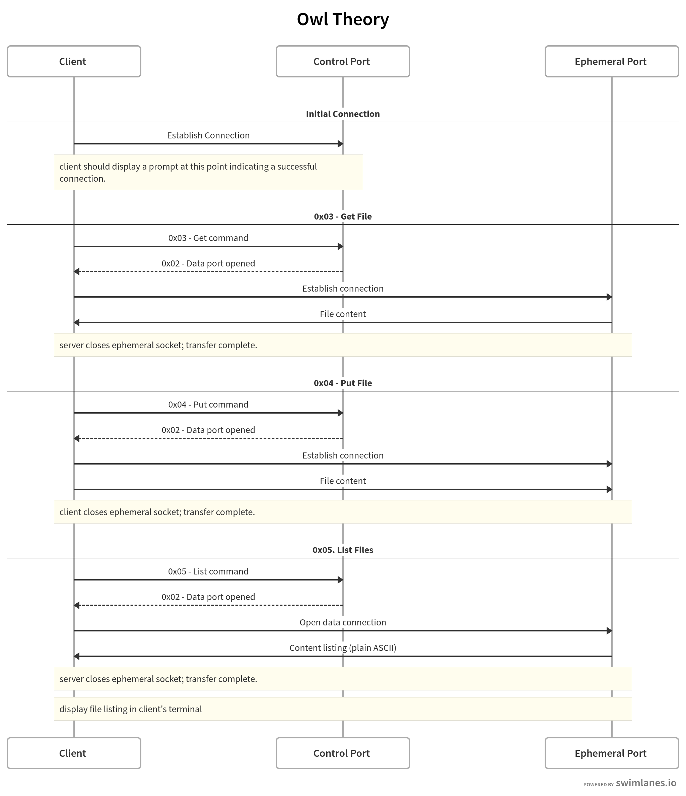

# Owl Theory Protocol Design

## Basic message format

`0x01 0xCMD [0xDATA...0xDATA-N] 0x00`

* `0x01` denotes start of message (SoM)
* Minimum message size is 3 bytes (if no data is included)
* `0xCMD` indicates one-byte command code from table in the [quick reference](#quick-reference).
* **All messages are null-terminated.**

## Commands

A swimlane sequence diagram can be found and edited here: https://swimlanes.io/d/UhF7Bk5NL

The sequence diagram is also embedded at the bottom of this document.

### Quick Reference

|Sent from|Command Code|Command Name|Command Alias|
|---|---|---|---|
|Server|0x02|[Data port opened](#0x02-data-port-opened)|N/A|
|Client|0x02|Client Quitting|N/A|
|Client|0x03|[Get](#0x03-get-file-get-path)|`get <path>`|
|Client|0x04|[Put](#0x04-put-file-put-path)|`put <path>`|
|Client|0x05|[List](#0x05-list-ls-path)|`ls [path]`|

### Server-to-client

#### `0x02` Data port opened

Sent to client when server has opened an ephemeral port. Contains two bytes of data indicating the port which was opened.

Example: server opens port 32768 = 0x80 0x00

```
SERVER:
 SoM  CMD PORTH PORTL  NUL
0x01 0x02  0x80  0x00 0x00
```

### Client-to-server

#### `0x03` Get file `get <path>`

Gets a file from the server and sends it to the client.

After receiving this command, the server should open an ephemeral port and send the port number to the client with command `0x02`.

Example for retrieving `helloworld.txt` with server opening ephemeral port at 32768

```
CLIENT:
 SoM  CMD    h    e    l    l    o    w    o    r    l    d    .    t    x    t  NUL
0x01 0x03 0x68 0x65 0x6c 0x6c 0x6f 0x77 0x6f 0x72 0x6c 0x64 0x2e 0x74 0x78 0x74 0x00
 
SERVER:
 SoM  CMD PORTH PORTL  NUL
0x01 0x02  0x80  0x00 0x00
```

#### `0x04` Put file `put <path>`

Puts a file from to server from the client.

After receiving this command, the server should open an ephemeral port and send the port number to the client with command `0x02`.

Example for retrieving `helloworld.txt` with server opening ephemeral port at 32768

```
CLIENT:
 SoM  CMD    h    e    l    l    o    w    o    r    l    d    .    t    x    t  NUL
0x01 0x04 0x68 0x65 0x6c 0x6c 0x6f 0x77 0x6f 0x72 0x6c 0x64 0x2e 0x74 0x78 0x74 0x00

SERVER:
 SoM  CMD PORTH PORTL  NUL
0x01 0x02  0x80  0x00 0x00
```

#### `0x05` List `ls [path]`

Lists files in a directory, if given. Otherwise, list files at the servers 'root' directory (TBD; this could be a configuration variable, or we could just assume the root directory to be where `server.py` is executing; might be insecure).

After receiving this command, the server should open an ephemeral port and send the port number to the client with command `0x02`.

Example for listing contents of `joshsfiles/` with server opening ephemeral port at 32768

```
CLIENT:
 SoM  CMD    j    o    s    h    s    f    i    l    e    s    /  NUL
0x01 0x05 0x6a 0x6f 0x73 0x68 0x73 0x66 0x69 0x6c 0x65 0x73 0x2f 0x00

SERVER:
 SoM  CMD PORTH PORTL  NUL
0x01 0x02  0x80  0x00 0x00
```

## Sequence Diagram


